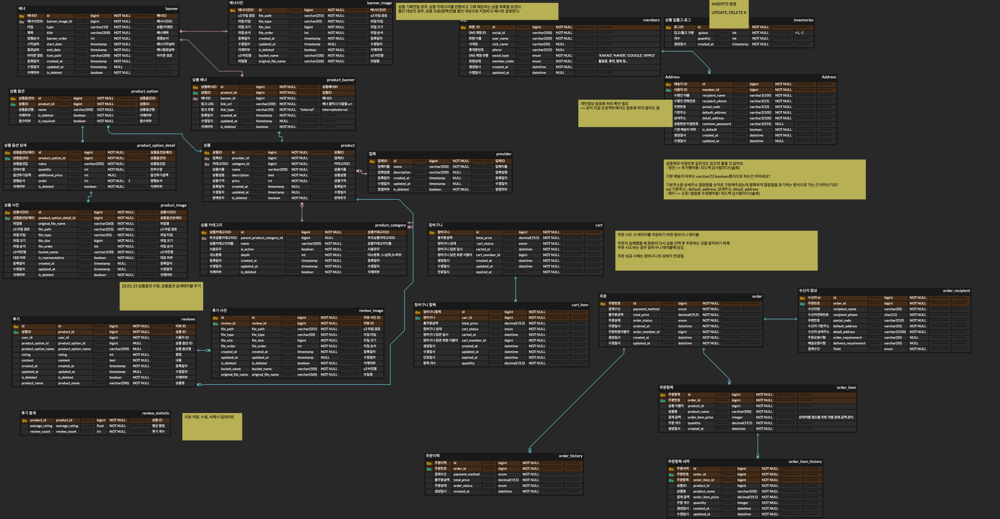

# 감성카트

## Table of Contents

- [Introduction](#introduction)
- [ERD](#erd)
- [✨ Tech Stack](#-tech-stack)

## Introduction

- 감성카드

## ERD

- 자세한 감성카트 ERD를 [여기에서 확인](https://www.erdcloud.com/d/MkAMBKwMiAy57xxQZ)하세요.

## ✨ Tech Stack

### 🛠️ Development

- **Language & Framework**: Java 21, Spring Boot 3
- **IDE**: IntelliJ, Cursor
- **ORM**: JPA

### 🗄️ Database

- **DBMS**: MySQL

### 🔐 Authentication

- **Spring Security**, **JWT**, **OAuth 2.0**

### ⚙️ CI/CD

- **Tools**: GitHub, GitHub Actions, Jenkins

### 🧪 Test

- **Framework**: JUnit

### 🏛️ Architecture

- **Style**: Layered, Multi-Module

### 🎨 Design

- **Approach**: Domain-Driven Design (DDD)

